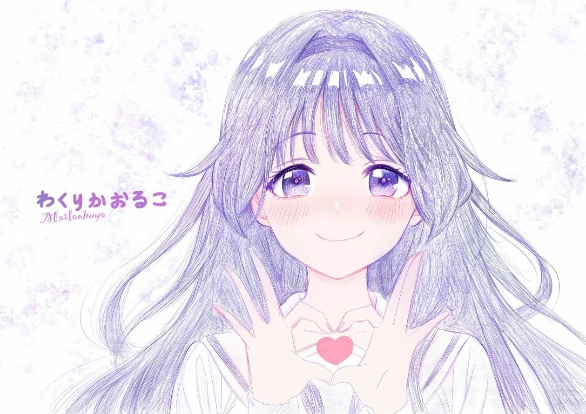

<div align="center">

# 🌸 dsh-startup-animation

**给 DeepSeek Harness 的开机动画 + 主界面壁纸**

*打开软件的那两秒，也可以很好看喵。*



</div>

---

## ✨ 它会做什么

一次开机，演这么一出小戏 🎬

| 时刻 | 画面 |
| --- | --- |
| `0.0s` | 主界面被 `<head>` 里的早脚本提前藏好，**不会先闪一下白底主界面** |
| `~0.1s` | 背景图缓缓推近 · 三团极光来回漂 · 一束放射光慢慢转 · 星尘一闪一闪 · 光点往上飘 · 流星偶尔掠过 |
| `~0.2s` | 头像「啵」地弹进来，套一圈爆闪环 + 四周迸出星火 + 两圈涟漪，还有一道玻璃反光扫过 |
| `~0.3s` | 「**欢迎回来**」一个字一个字浮上来，下面一条渐变细线展开 |
| 全程 | 两圈加载环一顺一逆慢慢转 · 头像自己极慢地推近 · 鼠标一动整屏按远近**分层视差**跟着晃、头像跟着轻轻 3D 倾斜，还有一盏暖光跟着指针走 🐾 |
| 加载好了 | 背景被"镜头收住"：从推近状态收回到 1:1（看得见的那一下），启动页整层淡出；**主界面的各个模块一块块拼上来** 🧩 |
| 进去之后 | 主界面壁纸**就是同一张背景图**，所以过场看起来像"背景由虚转实"，接得很顺 🍃 |

最短演 1.5 秒，最多挡你 5 秒；**点一下或者按任意键**就能跳过。

进主界面之后还有一处改造：新会话那行标题**摘掉左边的鲸鱼 logo 和右边的「预览版」徽章**，然后把「探索未至之境」换成你自己写的问候语，**一个字一个字打出来**，末尾跟着一根一闪一闪的输入光标 —— 像有个人正在跟你说话（默认就是「你好，我是和栗薰子，欢迎使用Deepseek Harness」）。

文案、速度、光标、两个隐藏开关**都在设置里改**，存盘立刻在主界面生效，不用刷新 👇

而且——**两张图都能在设置里自己换**，换完当场就能预览，不用重启 👇

## 🎀 设置：启动动画与壁纸

| 位置 | 做什么 |
| --- | --- |
| 顶部「实时预览」 | 把开机那一份启动动画原样嵌在小窗里播放（连主界面壁纸一起，收尾的交接也看得到）。换完图**自动重放**，「重播」手动重放，「新标签打开」放大看 |
| 主界面标题卡片 | 问候语文案、打字机开关、每字间隔（10~1000ms）、闪烁光标与其字符、**隐藏 logo / 隐藏「预览版」徽章**。存盘即生效，标题会当场重打一遍 |
| 头像卡片 | 开机动画正中那张。点「选择图片」，或者**直接把图拖到卡片上**。圆角方框显示，不会把猫耳朵裁掉 🐱 |
| 背景图卡片 | 开机背景 + 主界面壁纸。建议横图，界面里按 cover 铺满 |
| 恢复默认 | 删掉自定义图，回到包里自带的图；标题卡片上的「恢复默认」则回到上面那句默认问候语 |
| 在真实界面里看一遍 | 清掉"刚看过"的标记再刷新，真的在 DSH 里重放一遍 |

- 支持 **PNG / JPEG / WebP / GIF**，单张上限 **12MB**（按文件魔数识别，不看 Content-Type）
- 自定义图与标题配置都存在 `$DSH_HOME/dsh-startup-animation/`（图片 + `config.json`），删掉文件或点「恢复默认」即可还原
- 壁纸与标题**存盘就生效**，不用重启；在预览小窗里看一遍也**不会**让真实页面误以为"已经播过了"

## 🚀 安装

```powershell
git clone https://github.com/KylinQ01/dsh-startup-animation.git
```

然后把依赖写进 profile 的 `package.json`（`link:` 指向刚 clone 下来的目录）：

```jsonc
// ~/.dsh/profiles/<profile>/package.json
"dependencies": {
  "dsh-startup-animation": "link:/绝对路径/dsh-startup-animation"
}
```

```powershell
dsh plugin --profile desktop install --offline   # 建好 node_modules 链接，并自动加进 dsh.profile.bundles
dsh --profile desktop --dump-config | Select-String startup-animation   # 看到 id: dsh-startup-animation 就对了
```

然后**重启 DSH**（DSH Desktop 或 `dsh web`）。宿主日志里会出现：

```
[dsh-startup-animation] dsh-startup-animation: 启动动画 + 主界面壁纸已挂载，图片目录 …
```

> ⚠️ Windows 上路径里带空格的话，**别用 `dsh plugin add` 传路径** —— 它经 cmd 转发会把参数切碎，
> 手动写进 `package.json` 再 `install` 就好。

**卸载**：从 profile 的 `package.json` 里删掉依赖，再跑一次 `dsh plugin install`，`bundles` 会被自动回收。
（插件目录别删也别改名 —— profile 通过 `link:` 指着它呢。）

## 🎛 想自己改改

| 想改 | 改哪里 |
| --- | --- |
| 节奏：最短/兜底时长、就绪判定、过场时长、星尘光点数量 | `assets/boot.js` 顶部那几个常量（`SPARKS` 是入场星火数） |
| 头像大小圆角、文字、进度条 | `assets/boot.css` 的 `.dshs-avatar` / `.dshs-hello` / `.dshs-bar` |
| 背景推近速度与幅度 | `.dshs-bg` 的 `transform: scale(...)` 两处（入场值 / is-in 值）与 26s 那个时长 |
| **极光颜色与浓淡** | `.dshs-aurora i:nth-child(1~2)` 的两组 `radial-gradient` |
| 星尘 / 光点 / 流星 | `.dshs-star` / `.dshs-petal` / `.dshs-streaks` |
| **两圈加载环** | `.dshs-orbit`（大小、粗细、转速、颜色都在这里；第二圈是 `.dshs-orbit + .dshs-orbit`） |
| **跟随指针的暖光** | `.dshs-cursor` 的 `radial-gradient` 与 `translate` 里的 `50vw/50vh` |
| **头像 3D 倾斜幅度** | `.dshs-portrait` 的 `rotateY/rotateX` 里那两个 `6deg/5deg` |
| **鼠标视差幅度** | `boot.css` 顶部三条 `translate: calc(var(--dshs-px) * Npx)`，改那个 N 就是改纵深 |
| 主界面壁纸浓淡 / 侧栏透明度 | `assets/wallpaper.css` 的 `--dshs-wall-veil-a/b`（越大越淡）与 `--dsw-specific-sidebar-fill` |
| **主界面问候语 / 打字机 / 光标 / 摘 logo 与徽章** | 设置页的「主界面标题」卡片（存 `$DSH_HOME/dsh-startup-animation/config.json`）；想改判断 hero 的锚点或光标动画，看 `client/client.js` 的 `HERO_FROM` 与 `assets/hero.css` |

## 🪶 为什么它不卡（低配机友好）

默认这版是**照着"老机器 / 核显"调的**：同一个画面，帧间隔中位数从 50ms 降到 33ms
（软件渲染下实测，帧数翻倍；p90 从 117ms 降到 50ms）。做法是**砍掉"逐帧重绘"类的开销，
保留全部"纯合成"类的动效** —— 前者吃填充率，后者几乎不要钱：

| 砍掉的 | 为什么 |
| --- | --- |
| 背景的 `filter: blur(6px)` | 全屏模糊，而且背景一边缩放一边带滤镜 = 每帧重算整屏。改由白纱 + 暗角营造"退远"感 |
| 旋转光束（conic + `mask-image`） | 单层就 132vmax（≈2500×2500px），还叠遮罩混合 + 持续旋转，是全场最贵的一项 |
| 极光的 `scale` 动画 | 柔光一缩放就要按新尺寸重新栅格化整层；现在只平移 |
| 头像内部的 `scale(1.09→1)` | 在 `overflow:hidden` + 圆角里缩放图片，每帧重裁一次 |
| 暗角的"呼吸" | 全屏不透明度动画 = 整段时长都在混合整屏像素 |
| 星尘 30→16、光点 16→10、星火 12→8，阴影去掉一层 | 元素与阴影数量直接等于绘制量 |
| 壁纸的 `background-attachment: fixed` | 这个应用没有整页滚动，固定不固定看不出区别，但 fixed 会走更慢的合成路径 |

> 主界面那套「模块组装」**没有**牺牲性能：原来是"整棵 `#root` 淡入一次"，
> 现在是"几个模块各自淡入"——总像素量基本一样，只是拆到了几块上，而观感强得多。

**想要回满配版**：把上面几项加回去即可，`node check.mjs` 不会拦你（只会在用到 `filter` / `mask`
时打印一行"低配机上会掉帧"的提醒）。机器够好、又想要那束旋转光，加回去完全没问题。

改 `lib/index.js`（路由、注入）要重启宿主；只改 `client/client.js` 由客户端 HMR 热更。

**过场是"一条 700ms 的时间轴"**：`boot.css` 里 `#dshs.is-out` 的 `opacity .7s` 要和
`boot.js` 的 `OUT_MS = 700` 一致，否则启动页会提前摘掉或拖尾。

**主界面「模块组装」怎么挑模块**：`boot.js` 的 `assemble()` 靠**几何尺寸**挑，不看类名 ——
先找"第一层就有 ≥2 个够大的孩子"的那一层（只有 1 个大孩子说明还套着外壳，再往里走一层），
再把最大那块里"又宽又扁"的子模块（工具条、输入区）补进来，最多 6 块。
阈值是 `big()` / `medium()` 里那两个百分比，行程/错峰/时长是 `ASSEMBLE_MS`、`ASSEMBLE_STEP`、
`ASSEMBLE_DELAY`。**前端改结构也不会失效**，但如果哪块没动，先看是不是没通过尺寸阈值。

**过场里别加 `transition-delay`，也别加 `will-change`**：主界面这时正在首次渲染，
主线程一忙，走主线程的 `opacity` 过渡会比合成器上的位移晚开始；延时只会让它对不齐，
而 `will-change: opacity` 挂在这么大的合成层上只会更慢。（这是实测踩出来的。）

**收尾靠三处对齐才不会"跳"**，动其中任何一处都要三处一起看：

1. 启动页背景 `.dshs-bg` 不留 inset 富余，`object-fit: cover` 的取景＝主界面壁纸的 `center/cover`；
2. 收尾时 `.dshs-bg` 收到 `scale(1)` + 去虚化 + 视差归零（**用 transition 收，不要用 animation**：
   animation 一旦被撤掉会瞬间跳到目标值，那一下就看不见了）；
3. `.dshs-handoff` 用壁纸同一组白纱变量补齐白度（否则图片对上了、白度对不上，还是会闪一下）。

**摘节点的时机不能写死**：`boot.js` 是等 `transitionend`（opacity 跑完）才移除启动页，
定时器只做兜底。写成固定 `OUT_MS + 120` 的话，主线程一卡就会把还没淡完的启动页硬切掉 ——
看起来就是"没有转场"。

> `check.mjs` 会逐个核对 **boot.js 用到的类名在 boot.css 里有没有规则**（新增画面层时漏写直接报错），
> 也会检查上面这三处对齐有没有被改坏 🔍

## 🧪 自检 & 本地预览

```powershell
node check.mjs      # Node 18+
```

它会把路由、注入落点、幂等、脚本语法、上传/回退的完整来回、设置页组件全跑一遍，
最后生成 `preview/index.html` —— **双击就能完整看一遍动画与过场**，不用装进 DSH。

> 💡 用无头浏览器截图核对画面时注意：headless Chromium 默认把 `prefers-reduced-motion` 报成 `reduce`，
> 会关掉星尘/光点/循环动效，你看到的是"静音版"。要走 CDP `Emulation.setEmulatedMedia` 显式模拟
> `no-preference` 才是真实效果。

## ❓ 小问题

**刷新页面怎么不放动画？**
同一标签页 **60 秒内**重复刷新会自动跳过（自动重载循环不该每次都演一遍），只看壁纸变化。
想看：点设置里的「在真实界面里看一遍」，或者开个无痕窗口。

**切深色主题为什么没壁纸了？**
故意的。浅色图配浅色文字会糊成一片，所以深色主题保持原样。真想要：删掉
`wallpaper.css` 里的 `:not([data-ds-dark-theme])`，然后自己想好文字对比度怎么办 🙈

**会不会白屏？**
不会。任何一步抛异常都会立刻撤掉启动页、把主界面放出来 —— 最坏情况是"没有动画"，
绝不是"打不开"。另外 `<head>` 里还留了 8 秒自动放行的保险。

**系统开了「减少动态效果」怎么办？**
**关掉**一切"会一直动"和"跟着人动"的东西：星尘 / 光点 / 流星、极光漂移、柔光呼吸、加载环旋转、
头像浮动、玻璃反光、指针视差与 3D 倾斜、背景推近。
**保留**一次性的入场：模块组装（行程自动收到 35%）与启动页淡出。
理由是这条设置针对的是大位移、视差、持续旋转这类容易引发不适的动效，而不是"入场不许有动画"——
以前一刀切全关，结果在关掉了 Windows 动画的机器上**什么都看不见**（`prefers-reduced-motion` 读的就是那个开关）。

> 想让入场也彻底静音：把 `boot.js` 里 `assemble()` 开头的 `if (calm) return` 加回去。
>
> 反过来，Windows 的「辅助功能 → 视觉效果 → 动画效果」如果是关的，本插件只会走上面那条精简路径；
> 机器够好的话把它打开，星尘、极光漂移和指针视差那一整套才会出来。

## 📄 许可

[MIT](LICENSE) © KylinQ01

<div align="center">

*愿你每次打开它，都被好好欢迎一次。* 🌙

</div>
